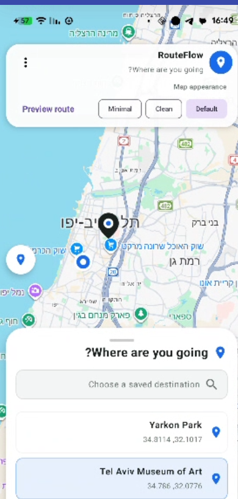
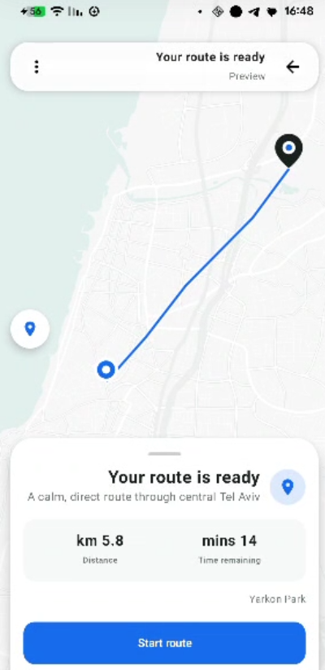
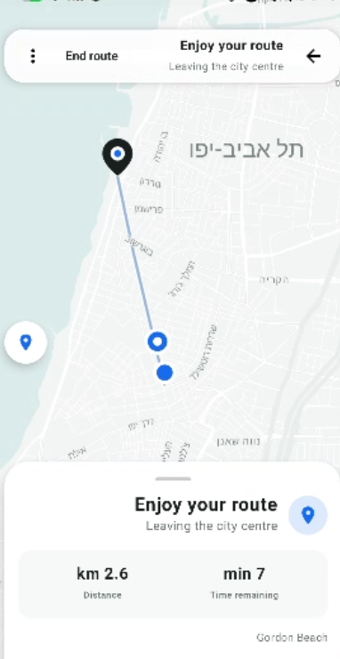
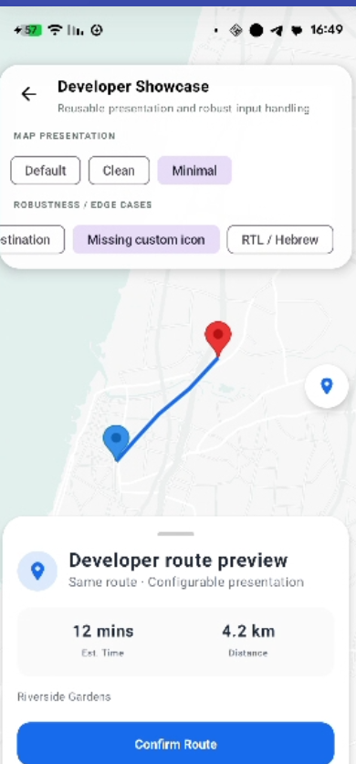

# RouteFlowKit

RouteFlowKit is a reusable Jetpack Compose UI library for polished map-based route experiences. A host supplies route, location, progress, and product state; RouteFlowKit renders the map, markers, route states, cards, and actions.

> Reusable Android UI components for polished map-based route experiences.

## Screenshots

<p align="center">
  
  
  
  
</p>

## Features

- Full screen map with a host supplied route polyline
- Start, destination, and optional current-location markers
- `DestinationSelection`, `RoutePreview`, `ActiveRide`, and `Arrived` modes
- Host driven route progress with completed and remaining route segments
- ETA, distance, status, actions, loading, and recovery states
- `Default`, `Clean`, and `Minimal` map presentation presets
- Configurable colors, route styling, strings, icons, marker resources, and card layout
- Defensive validation plus long-text, compact-screen, and RTL support
- Provider-independent public models; Google Maps types remain internal

## Installation

### JitPack


Add JitPack to `settings.gradle.kts`:

```kotlin
dependencyResolutionManagement {
    repositories {
        google()
        mavenCentral()
        maven { url = uri("https://jitpack.io") }
    }
}
```
Then add
```kotlin 
dependencies {
implementation('com.github.Stephkov:RouteFlowKit:v1.0.0')
}
```
### Local Module

Include the library module in `settings.gradle.kts`:

```kotlin
include(":routeflowkit")
```

Then add it to the consuming app:

```kotlin
dependencies {
    implementation(project(":routeflowkit"))
}
```

The consuming app owns the Google Maps API key. For the included demo, place it in the untracked `local.properties` file:

```properties
MAPS_API_KEY=your_key_here
```

## Quick Start

```kotlin
val origin = RouteWaypoint(
    label = "Pickup",
    location = GeoCoordinate(32.0853, 34.7818),
)
val destination = RouteWaypoint(
    label = "Destination",
    location = GeoCoordinate(32.1093, 34.8255),
)
val routeData = RouteFlowData(
    origin = origin,
    destination = destination,
    routeInfo = RouteInfo(
        polylinePoints = listOf(origin.location, destination.location),
        distanceMeters = 6_400.0,
        durationSeconds = 1_020,
    ),
)

RouteFlowMapScreen(
    mode = RouteFlowMode.RoutePreview,
    uiState = RouteFlowUiState.Ready(),
    presetDestinations = listOf(destination),
    data = routeData,
    mapPreset = RouteFlowMapPreset.Clean,
    onAction = { action -> /* Handle RouteFlowAction in the host. */ },
)
```

`RouteFlowMapScreen` also provides an overload with individual `origin`, `destination`, `routeInfo`, `currentLocation`, and `status` parameters.

## Usage Examples

### Route Preview

Supply a route and render the preview mode. `ConfirmRoute` is an intent for the host; RouteFlowKit does not perform the transition itself.

```kotlin
RouteFlowMapScreen(
    mode = RouteFlowMode.RoutePreview,
    uiState = RouteFlowUiState.Ready(),
    presetDestinations = listOf(routeData.destination!!),
    data = routeData,
    onAction = { action ->
        if (action is RouteFlowAction.ConfirmRoute) {
            // The host changes its state to ActiveRide.
        }
    },
)
```

### Route Progress

The host sends display-ready progress snapshots. RouteFlowKit clamps the fraction for rendering and updates the current marker, route segments, ETA, distance, and status.

```kotlin
RouteFlowMapScreen(
    mode = RouteFlowMode.ActiveRide,
    uiState = RouteFlowUiState.Ready(),
    presetDestinations = emptyList(),
    data = routeData,
    progress = RouteProgress(
        currentLocation = latestLocation,
        progressFraction = 0.45f,
        remainingDistance = "1.7 km",
        remainingEta = "8 min",
        status = "On route",
    ),
    onAction = { action -> /* Handle RouteFlowAction in the host. */ },
)
```

`progressFraction` is a presentation approximation over the supplied polyline. A value of `1f` does not automatically switch the mode to `Arrived`.

### Map Presentation Presets

```kotlin
mapPreset = RouteFlowMapPreset.Default
mapPreset = RouteFlowMapPreset.Clean
mapPreset = RouteFlowMapPreset.Minimal
```

| Preset | Presentation |
|---|---|
| `Default` | Normal map-provider appearance |
| `Clean` | Light, lower-noise map with useful labels retained |
| `Minimal` | Light geometry with most labels, POIs, businesses, and transit clutter suppressed |

The preset API is provider-independent. Google Maps style objects and JSON remain internal.

### Customization

```kotlin
val routeStyle = RouteFlowStyle.EmeraldCleanLight.copy(
    primaryColor = Color(0xFF176BEB),
    routeColor = Color(0xFF176BEB),
    completedRouteColor = Color(0xFF176BEB),
)

val routeStrings = RouteFlowStrings(
    routePreviewTitle = "Your route",
    startRideButton = "Start route",
    activeRideStatus = "On route",
)

val routeIcons = RouteFlowIcons(
    activeRide = activeRouteIcon,
    destinationMarkerResourceId = destinationMarkerDrawable,
)
```

Pass these values through the `style`, `strings`, and `icons` parameters of `RouteFlowMapScreen`. Null marker resources safely retain the default marker appearance.

## API Reference

| API | Purpose |
|---|---|
| `RouteFlowMapScreen` | Primary composable; renders a route mode and UI state from host-supplied data |
| `RouteFlowData` | Groups origin, destination, route information, current location, and status |
| `GeoCoordinate` | Provider-independent latitude and longitude |
| `RouteWaypoint` | Display label plus `GeoCoordinate` |
| `RouteInfo` | Host-supplied polyline points, distance in meters, and duration in seconds |
| `RouteProgress` | Current location, progress fraction, remaining distance, remaining ETA, and status |
| `RouteFlowMode` | `DestinationSelection`, `RoutePreview`, `ActiveRide`, or `Arrived` |
| `RouteFlowAction` | User intents returned to the host, including select, confirm, cancel, finish, reset, retry, and recovery actions |
| `RouteFlowStyle` | Colors, route widths, card geometry, spacing, and button/map-control styling |
| `RouteFlowStrings` | Visible copy, formatting strings, accessibility labels, and recovery messages |
| `RouteFlowIcons` | Compose card icons and host drawable resource IDs for map markers |
| `RouteFlowMapPreset` | Provider-independent `Default`, `Clean`, or `Minimal` map presentation |

`RouteFlowUiState` independently represents `Ready`, `Loading`, missing-destination, unavailable-route, permission, location-service, and error states. Optional `enforceValidRoute` validation is disabled by default for backward compatibility.

## Host Responsibilities

The host application owns:

- GPS and location retrieval
- Route calculation
- Geographic route-progress calculation
- ETA calculation
- Remaining-distance calculation
- Permission handling
- Location-services detection
- Navigation and state transitions
- Backend and network logic

RouteFlowKit receives the supplied data and state and renders the map UI. It does not retrieve location, calculate a route, perform navigation, or call backend services.

## Demo App

The `app` module demonstrates one flagship flow:

```text
Destination Selection -> Route Preview -> Active Route -> Arrived
```

It provides three mock destinations, selectable map presets, and app-owned progress snapshots. A secondary Developer Showcase exposes map-preset comparisons and selected robustness scenarios without cluttering the main flow.

## Project Structure

```text
app/                         demo application and mock host state
routeflowkit/                reusable Android library
  src/main/kotlin/.../
    model/                   provider-independent route data
    state/                   render states
    action/                  host-facing user intents
    style/                   styles, strings, icons, layout, presets
    validation/              pure input validation
    ui/                      public composables and internal map rendering
  src/test/                  JVM validation and rendering-logic tests
```

## Edge Cases Handled

Edge-case behavior lives in the library. The demo supplies inputs; RouteFlowKit validates or renders the appropriate state.

| Case | Behavior | Implementation | Verification |
|---|---|---|---|
| Invalid coordinates: EC-1 latitude, EC-2 longitude, EC-3 NaN, EC-4 infinity | Rejects non-finite and out-of-range coordinates | [validator](routeflowkit/src/main/kotlin/com/example/routeflowkit/validation/RouteInputValidator.kt#L27-L41) | [coordinate tests](routeflowkit/src/test/kotlin/com/example/routeflowkit/validation/RouteInputValidatorTest.kt#L23-L81) |
| EC-5 blank labels | Rejects blank waypoint labels | [validator](routeflowkit/src/main/kotlin/com/example/routeflowkit/validation/RouteInputValidator.kt#L44-L49) | [waypoint tests](routeflowkit/src/test/kotlin/com/example/routeflowkit/validation/RouteInputValidatorTest.kt#L94-L123) |
| EC-6 identical origin and destination | Rejects equal endpoints | [validator](routeflowkit/src/main/kotlin/com/example/routeflowkit/validation/RouteInputValidator.kt#L51-L60) | [endpoint test](routeflowkit/src/test/kotlin/com/example/routeflowkit/validation/RouteInputValidatorTest.kt#L137-L142) |
| EC-7 missing/too-short route, EC-8 duplicate waypoints | Requires at least two unique, valid waypoints | [validator](routeflowkit/src/main/kotlin/com/example/routeflowkit/validation/RouteInputValidator.kt#L63-L81) | [route-list tests](routeflowkit/src/test/kotlin/com/example/routeflowkit/validation/RouteInputValidatorTest.kt#L158-L202) |
| Defensive invalid polyline handling | Omits empty, single-point, or invalid polylines instead of passing them to the map | [internal mapper](routeflowkit/src/main/kotlin/com/example/routeflowkit/model/Mappers.kt#L13-L22) | [mapper tests](routeflowkit/src/test/kotlin/com/example/routeflowkit/model/RoutePolylineMapperTest.kt#L23-L37) |
| Missing destination or route | Renders explicit recoverable/blocking message states; opt-in screen validation derives them from supplied input | [screen validation](routeflowkit/src/main/kotlin/com/example/routeflowkit/ui/RouteFlowContainer.kt#L185-L226), [message UI](routeflowkit/src/main/kotlin/com/example/routeflowkit/ui/RouteFlowMessageCard.kt#L101-L127) | [state model](routeflowkit/src/main/kotlin/com/example/routeflowkit/state/RouteFlowUiState.kt#L21-L32) |
| Permission, location services, and generic errors | Renders host-supplied message states without requesting permissions or reading GPS | [state model](routeflowkit/src/main/kotlin/com/example/routeflowkit/state/RouteFlowUiState.kt#L34-L44) | [message UI](routeflowkit/src/main/kotlin/com/example/routeflowkit/ui/RouteFlowMessageCard.kt#L128-L168) |
| EC-9 long text | Bounds and scrolls cards; ellipsizes constrained labels | [destination card](routeflowkit/src/main/kotlin/com/example/routeflowkit/ui/DestinationPickerCard.kt#L74-L75), [route card](routeflowkit/src/main/kotlin/com/example/routeflowkit/ui/RouteBottomCard.kt#L78-L110) | [long-text preview](routeflowkit/src/main/kotlin/com/example/routeflowkit/ui/RouteFlowEdgeCasePreviews.kt#L23-L32) |
| EC-10 missing icon | Uses optional icons and safe fallback visuals | [fallback UI](routeflowkit/src/main/kotlin/com/example/routeflowkit/ui/DestinationPickerCard.kt#L86-L101), [icon defaults](routeflowkit/src/main/kotlin/com/example/routeflowkit/style/RouteFlowIcons.kt#L14-L35) | [missing-icon preview](routeflowkit/src/main/kotlin/com/example/routeflowkit/ui/RouteFlowEdgeCasePreviews.kt#L34-L44) |
| EC-11 small screens | Keeps cards height-bounded and vertically scrollable | [route card](routeflowkit/src/main/kotlin/com/example/routeflowkit/ui/RouteBottomCard.kt#L69-L80) | [320 dp preview](routeflowkit/src/main/kotlin/com/example/routeflowkit/ui/RouteFlowEdgeCasePreviews.kt#L46-L58) |
| EC-12 RTL/Hebrew | Uses the same components with host layout direction and localized strings | [Hebrew strings](routeflowkit/src/main/kotlin/com/example/routeflowkit/style/RouteFlowStrings.kt#L68-L104) | [RTL preview](routeflowkit/src/main/kotlin/com/example/routeflowkit/ui/RouteFlowEdgeCasePreviews.kt#L60-L71) |

## Requirements

- Minimum SDK 26
- Compile SDK 36.1
- Java 11
- Kotlin 2.1.21 and Android Gradle Plugin 9.2.1
- Jetpack Compose (Compose BOM 2024.12.01)
- Maps Compose 6.2.0 and Play Services Maps 19.0.0
- A Google Maps API key configured by the consuming app

## License

RouteFlowKit is available under the [MIT License](LICENSE).
